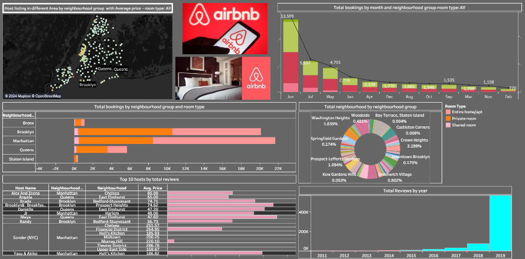
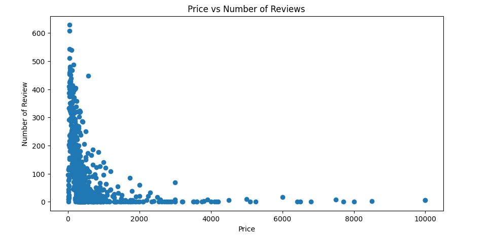
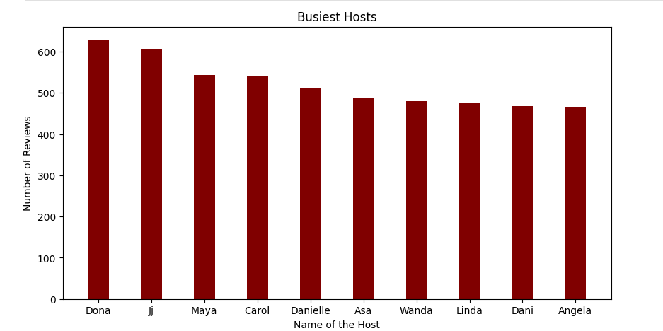
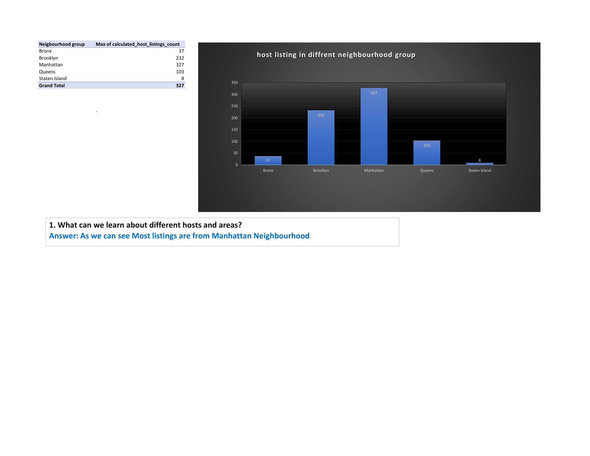
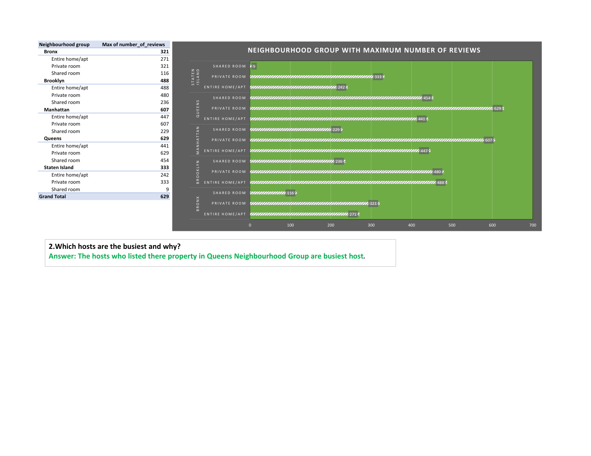
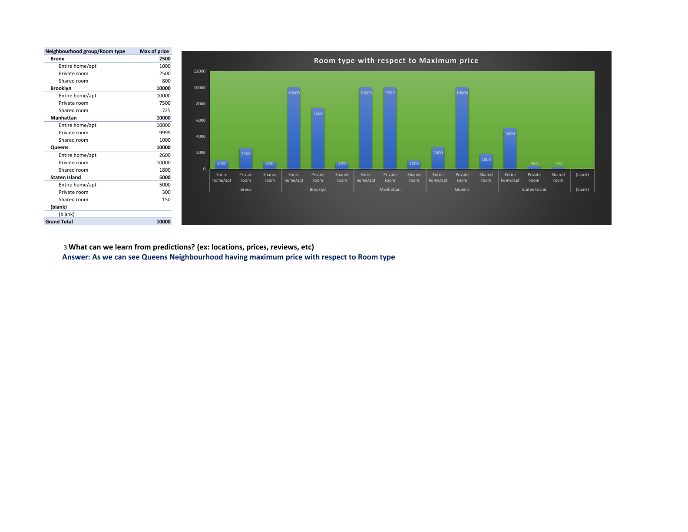
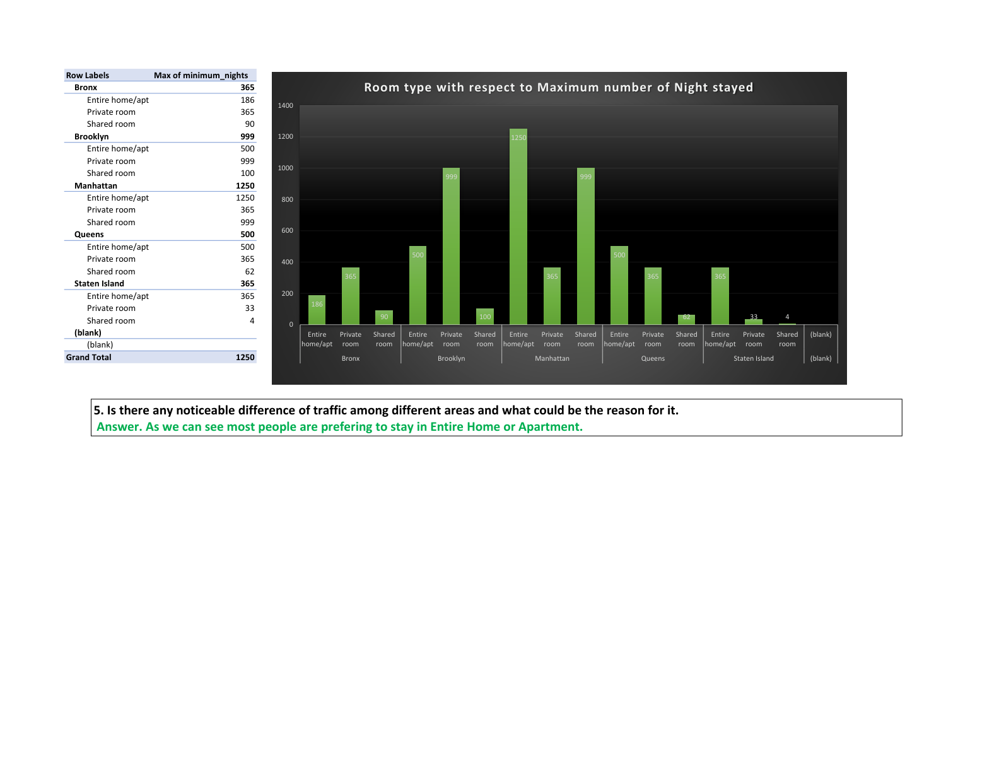

# Airbnb Booking Analysis \| Exploratory Data Analysis (EDA)

## Author

**Md Mahfooz Alam Ansari**

Completed as an end-to-end Exploratory Data Analysis (EDA) project using
**Python, Tableau, and Microsoft Excel**.

## Project Overview

This project analyzes the Airbnb NYC 2019 dataset using Python,
Microsoft Excel, and Tableau to uncover insights into listings, hosts,
pricing, reviews, room types, and neighbourhoods.

## Dataset Information

-   Dataset: Airbnb NYC 2019
-   Records: \~49,000
-   Features: 16
-   Domain: Hospitality & Tourism

## Tech Stack

-   Python
-   Pandas
-   NumPy
-   Matplotlib
-   Microsoft Excel
-   Tableau
-   Google Colab
-   GitHub

## Key Objectives

1.  Learn about different hosts and neighbourhoods.
2.  Explore prices, reviews, and locations.
3.  Identify the busiest hosts.
4.  Compare traffic across neighbourhoods.

## Project Workflow

1.  Data Collection
2.  Data Cleaning
3.  Exploratory Data Analysis
4.  Data Visualization
5.  Business Insights
6.  Tableau Dashboard
7.  Excel Pivot Analysis

## Project Visualizations

### Price vs Number of Reviews

### Top 10 Busiest Hosts

### Tableau Dashboard

### Excel Analysis -- Host Listings by Neighbourhood

### Excel Analysis -- Maximum Reviews by Neighbourhood

### Excel Analysis -- Maximum Price by Room Type

### Excel Analysis -- Maximum Minimum Nights

## Business Insights

-   Manhattan and Brooklyn have the highest listing concentration.
-   Budget-friendly listings receive more reviews.
-   Entire homes and private rooms dominate demand.
-   Tableau and Excel complement Python EDA.

## Notebooks and Tools

### Notebooks

1.  [Google Drive
    Import](https://colab.research.google.com/drive/1zRZv0eqaY94D4CEpTICRqKSlMH2wxm2E)

### Data Analysis Tools

-   **Python**: numpy, pandas, matplotlib.
-   **Tableau**:
    https://public.tableau.com/views/AirbnbTableau_16884627478810/Dashboard4?:language=en-US&:display_count=n&:origin=viz_share_link
-   **Microsoft Excel**:
    https://1drv.ms/x/s!AiRYdqGxH35EgWc-2QktrV3r_slq?e=d25bbq

## Conclusions

-   Manhattan leads in listings.
-   Lower-priced properties attract more reviews.
-   Python, Excel, and Tableau together provide comprehensive analysis.

## Instructions for Running the Code

1.  Clone the repository.
2.  Install dependencies.
3.  Open the notebook.
4.  Run all cells.

## Dependencies

-   numpy
-   pandas
-   matplotlib
-  [Tableau](public.tableau.com/views/AirbnbTableau_16884627478810/Dashboard4?:language=en-US&:display_count=n&:origin=viz_share_link)
-   [Microsoft
    Excel](https://1drv.ms/x/s!AiRYdqGxH35EgWc-2QktrV3r_slq?e=d25bbq)

## How to Contribute

Create an issue or submit a pull request.

## License

This project is licensed under the MIT License. See the LICENSE file for
details.

